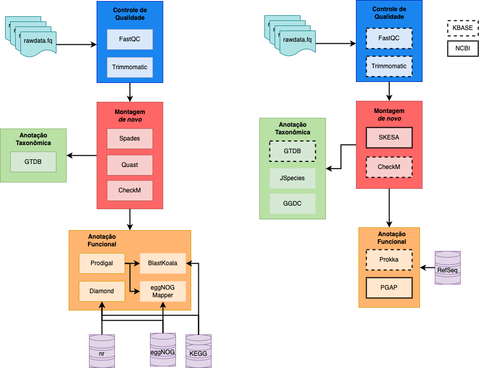
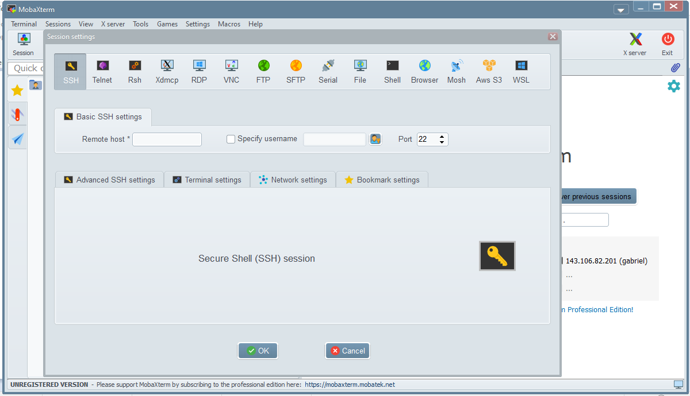
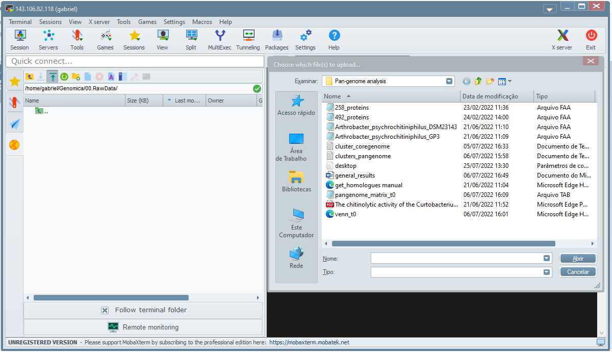
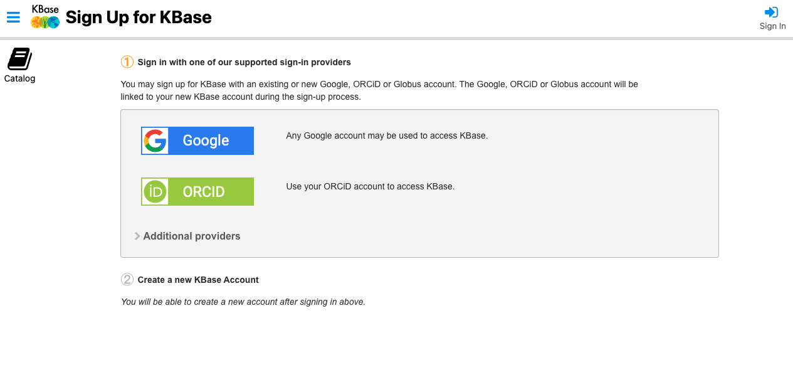
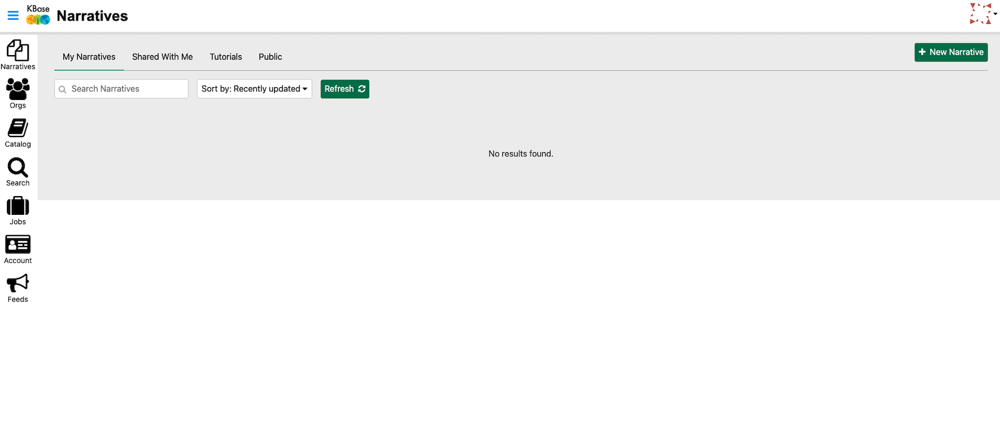
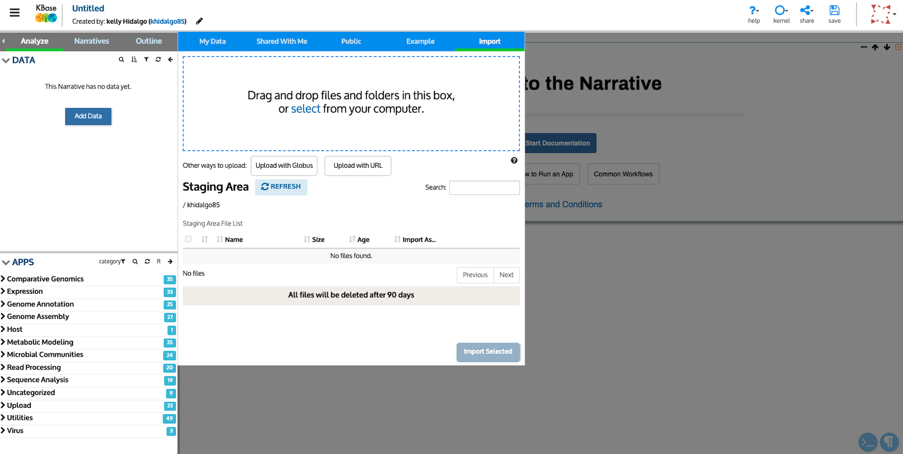
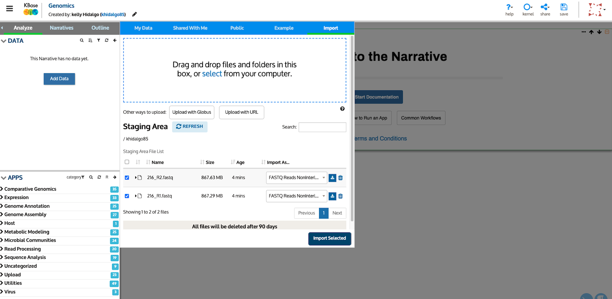
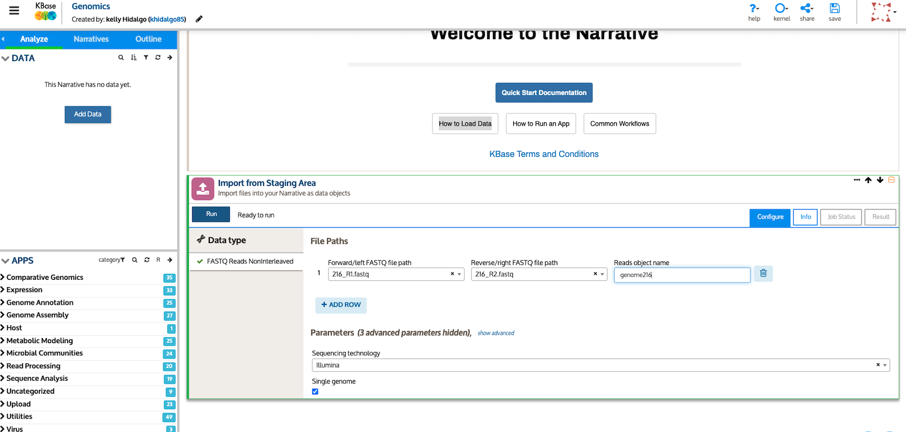

<!-- README.md is generated from README.Rmd. Please edit that file -->
<!-- badges: start -->

<!-- badges: end -->

# Tutorial para análises de genomas

**Autores: MsC. Kelly Hidalgo** **MsC. Luis Gabriel Cueva Yesquén**

Pipeline para montagem e anotação taxonômica e funcional de genomas de
isolados. Para este tutorial será usado como modelo um genoma
bacteriano,sequenciado na plataforma Illumina (2 x 250 bp). As análises
serão conduzidas seguindo duas abordagens, baseados em linha de comando
(CLI *Command Line Interface*) e usando ferramentas online (GUI
*Graphical User Interface*).

------------------------------------------------------------------------

# WORKFLOW

# CLI

## 0. Organização de Dados

### 0.1. Login no servidor

Para os usuários baseados em Windows é necessário a instalação do
software
[MobaXterm](https://mobaxterm.mobatek.net/download-home-edition.html#:~:text=MobaXterm%20Home%20Edition%20v22.1%0A(Installer%20edition)).

Após instalado, clique na opção *session*, escolha o icone ssh e
preencha com os dados do login: *remote host* (endereço IP). Depois
selecione a opção *specify name* e preencha com o nome do usuario. Por
último será solicitada a senha. Você pode salvar os dados do login.

### 0.2. Sequências

As sequências foram obtidas do sequenciamento na plataforma Illumina
usando o protocolo *paired-end* (2 x 250 bp) de cepa bacteriana EP216.

**Arquivos**

-   `216_R1.fastq`
-   `216_R2.fastq`

> **Dica:** Usualmente os arquivos são entregues com nomes codificados
> do equipamento usado para o sequenciamento que não são informativos
> para o usuário. Sempre renomee os arquivos com palavras de fácil
> identificação. Evite espaços e caracteres especiais. Para separar
> palavras prefira *underline* `_`.

### 0.2. Criação de diretórios

Os seguintes comandos são para criar, organizar e explorar diretórios.

-   Crie um diretório base para todo o processo usando o comando `mkdir`
    (*make dir*)

<!-- -->

    mkdir genomica

-   Entre ao novo diretório usando o comando `cd` (*change directory*)

<!-- -->

    cd genomica/

-   Crie um novo diretório para armazenar as sequências brutas.

> **Dica:** Dado que a maiora das etapas do workflow são sequenciais, é
> recomendável nomear os diretórios começando com um número e assim
> manter a organização.

    mkdir 00.RawData

-   Crie os demais diretórios em uma linha de comando só

<!-- -->

    mkdir 01.FastqcReports 02.CleanData 03.Assembly 04.QualityAssembly 05.TaxonomyAnnotation 06.GenePrediction 07.FunctionalAnnotation

-   Use o comando `ll` (*list*) para listar o conteúdo do diretório
    atual

<!-- -->

    ll

### 0.3. Upload de sequências

As sequências devem ser descarregadas da plataforma da facility
contratada e subidas ao servidor usando o software MobaXterm. Coloque os
arquivos no diretório `00.RawData`

> **Dica:** Para aprender mais comandos úteis use o seguinte [tutorial
> de UNIX](https://github.com/khidalgo85/Unix)

## 1. Controle de Qualidade

### 1.1. Checagem da qualidade

Nesta etapa será acessada à qualidade das sequências usando a ferramenta
[FastQC](https://www.bioinformatics.babraham.ac.uk/projects/fastqc/).

Antes de rodar a análise, você deve saber que nos servidores as
ferramentas são instaladas usando um gerenciador de programas, chamado
Anaconda. O qual facilita a instalação das ferramentas em ambientes
virtuais separados, isto porque elas são desenvolvidas en diferentes
linguagens de programação (i.e. python, perl, R, etc.). Por tanto
precisa ser ativado o ambiente virtual onde foi instalado o FastQC, o
qual é `quality`

> **Dica:** Para saber que ferramentas estão instaladas e em que
> ambiente virtual revise o documento
> `/home/bioinfo/Documents/ferramentas.txt`

-   Ative o ambiente `quality`

<!-- -->

    source /home/anaconda3/bin/activate quality

Veja que antes do nome do usuário no prompt deve aparecer o nome do
ambiente entre parêntese.

-   Execute o comando do FastQC

<!-- -->

    fastqc -t 10 00.RawData/* -o 01.FastqcReports/

**Sintaxe**

    fastqc -t <num núcleos> <input_directory> -o <output_directory>

> **Dica:** **TODAS** as ferramentas bioinformáticas tem um manual de
> ajuda que pode ser acessado pela linha de comando, usando o flag `-h`
> ou `--help`. **ANTES de executar uma ferramenta sempre leia o
> manual**. Este comando lista todos os argumentos disponíveis para a
> ferramenta e explica como devem/podem ser usados.

> **Atenção:** Para o uso correto e seguro do servidor verifique o
> número de núcleos disponíveis para o usuário no momento da análise.
> **NUNCA** trabalhe com o total dos núcleos da máquina.

Os arquivos `.html` gerados no diretório `01.FastqcReports` podem ser
baixados usando os recursos gráficos de MobaXterm.

Para maiores detalhes sobre a interpretação e análise dos relatórios do
FastQC consulte
[aqui](https://www.bioinformatics.babraham.ac.uk/projects/fastqc/Help/3%20Analysis%20Modules/).

### 1.2. Trimagem e filtragem de sequências

A remoção de sequências e bases de baixa qualidade deve ser feita
baseada nos relatórios da checagem da qualidade. O programa
[Trimmomatic](http://www.usadellab.org/cms/?page=trimmomatic), através
de diversos argumentos realiza a filtragem e trimagem das sequências.

-   Segundo os resultados obtidos da qualidade execute o seguinte
    comando do Trimmomatic:

<!-- -->

    trimmomatic PE -threads 10 00.RawData/216_R1.fastq 00.RawData/216_R2.fastq 02.CleanData/216_R1.pair.fastq 02.CleanData/216_R1.unpair.fastq 02.CleanData/216_R2.pair.fastq 02.CleanData/216_R2.unpair.fastq LEADING:3 TRAILING:3 CROP:249 HEADCROP:15 SLIDINGWINDOW:4:15 MINLEN:100

**Sintaxe**

    trimmomatic PE -threads <num_nucleos> <file_input_R1> <file_input_R2> <file_output_pair_R1> <file_output_unpair_R1> <file_output_pair_R2> <file_output_unpair_R2> [argumentos]

Consulte o
[manual](http://www.usadellab.org/cms/uploads/supplementary/Trimmomatic/TrimmomaticManual_V0.32.pdf)
da ferramenta para obter mais detalhes.

Verifique que a etapa de trimagem e filtragem foi bem sucedida
executando FastQC para as sequências pareadas
(`02.CleanData/216_R1.pair.fastq` e `02.CleanData/216_R2.pair.fastq`).

## 2. Montagem *de novo*

### 2.1. Spades

Uma montagem é o processo de alinhamento de sequências curtas com o
objetivo de recuperar uma sequência maior. No caso da montagem *de novo*
são usados algorítmos baseados em *k-mers*, que são subsequências com
tamanho definido pelo usuário (i.e. 21-mers).

O programa [Spades](https://github.com/ablab/spades) está instalado no
ambiente `assembly`, por tanto deve ser ativado com o seguinte comando

    source /home/anaconda3/bin/activate assembly

A montagem será realizada executando o comando:

> **Dica:** O program nohup permite executar tarefas em segundo plano,
> com o objetivo de manter a execução do comando ainda com a perda da
> conexão.

    nohup spades.py --careful -1 02.CleanData/216_R1.pair.fastq -2 02.CleanData/216_R2.pair.fastq -k 21,33,55,77,99,111,127 -o 03.Assembly/ -t 10

**Sintaxe**

    spades.py -1 <pair1> -2 <pair2> -k <kmers list> -o <output_directory> -t <num_nucleos>

O flag `--careful` tenta reduzir o número de mismatches e indels curtos.
É recomendado para montagem de genomas de procariotas.

No [manual](http://cab.spbu.ru/files/release3.15.2/manual.html) encontra
mais detalhes.

### 2.2. Avaliação da montagem

A montagem precisa ser avaliada através de métricas que representam
qualidade do genoma. Neste paso será calculado o N50, o número de
contigs, o tamanho do genoma, a completude e o nível de contaminação.

Primeiro será executado o progama [Quast](http://quast.sourceforge.net/)
o qual está instalado no ambiente `quast`.

    source /home/anaconda3/bin/activate quast

Para gerar o relatório com as métricas use o seguinte comando:

    quast 03.Assembly/scaffolds.fasta -o 04.QualityAssembly/ --threads 10

**Sintaxe**

    quast <input_assembly> -o <output_directory> -t <num_nucleos> [opções]

Descarregue o arquivo `04.QualityAssembly/report.html` onde poderá
explorar todas as métricas de qualidade.

> **Dica:** Esta ferramenta permite comparar diversas montagens das
> mesmas sequências obtidas de diferentes montadores e/ou executados com
> diferentes parâmetros. Esta estratega permite escolher a melhor
> montagem. Para maiores detalhes, visete o
> [manual](http://quast.sourceforge.net/docs/manual.html)

Contigs com tamanho menor de 600 bp não tem um valor representativo na
montagem, é recomendável filtrar essas sequências.

O programa bbmap tem um script que permite realizar a filtragem por
tamanho. bbmap está instalado no ambiente bioinfo:

    source /home/anaconda3/bin/activate bioinfo

    reformat.sh in=03.Assembly/scaffolds.fasta out=03.Assembly/216_scaffolds_filtered.fasta minlength=600

Para avaliar a completude e a contaminação da montagem é usada a
ferramenta [CheckM](https://github.com/Ecogenomics/CheckM/wiki). A qual
usa uma base de dados própria de genes ortologos de cópia única.

Ative o ambiente `checkm`

    source /home/anaconda3/bin/activate checkm

Execute a ánalise para a montagem completa e filtrada com o seguinte
comando:

    checkm lineage_wf 03.Assembly/ 04.QualityAssembly/ -t 10 -x fasta --tab > 04.QualityAssembly/output.txt

**Sintaxe**

    checkm lineage_wf <input_directory/> <output_directory/> -t <num_nucleos> -x <format> --tab > output.txt

Explore o arquivo de saída `04.QualityAssembly/output.txt` usando o
comando `less`. Descarregue o relatório no seu computador.

Para mais detalhes sobre a interpretação do relatório visite este
[link.](https://www.biostars.org/p/447744/)

## 3. Anotação Taxonômica

A classificação baseada em dados de genoma tem maior poder ressolutivo
em comparação ao usar apenas um gene marcado, desde que esta abordagem
analisa múltiplos genes que refletem de forma mais robusta a relações de
parêntesco do organismo de interesse. O
[GTDB-tk](https://ecogenomics.github.io/GTDBTk/index.html) é uma
ferramenta que identifica 120 genes marcadores e os compara com uma base
de dados curada e constamente atualizada.

Esta ferramenta está instalada no ambiente `gtdbtk`

    source /home/anaconda3/bin/activate gtdbtk

Execute o seguinte comando:

    gtdbtk classify_wf --genome_dir 03.Assembly --out_dir 05.TaxonomyAnnotation/ -x fasta --cpus 10

**Sintaxe**

    gtdbtk classify_wf --genome_dir <input_directory/> --out_dir <output_directory/> -x <format> --cpus <num_nucleos>

O programa gera vários arquivos de saída que estão resumidos no
`05.TaxonomyAnnotation/gtdbtk.bac120.summary.tsv`.

## 4. Anotação Funcional

Under construction…

# GUI

Existem diversas plataformas online nas quais podem ser realizadas
diversas análises bioinformáticas. As mais conhecidas são
[KBase](https://www.kbase.us/) e [Galaxy](https://usegalaxy.org/). Neste
tutorial será usado o KBase, além da plataforma de montagem e anotação
do [NCBI](https://www.ncbi.nlm.nih.gov/genome/annotation_prok/).

## 0. Organização de Dados

### 0.1. Criando uma conta no KBase

Ingresse no link para criar uma conta:
[singup!](https://narrative.kbase.us/#signup)

[Neste link](https://docs.kbase.us/getting-started/narrative) você pode
visitar o extenso manual/tutorial da plataforma.

Para facilitar acesse através de uma conta Google

No KBase, você pode crias fluxos de trabalho compartilháveis e
reproduzíveis chamados **Narrativas** que incluem dados, etapas de
análise, resultados, visualizações e comentários.

### 0.2. Upload dos dados

O primeiro passo é criar uma nova narrativa clicando em *+ New
Narrative*. Uma vez criada a nova narrativa, troque o nome dela para
Genômica, clicando no título acima a esquerda *Untitled*

Na seção **DATA** será aberta uma aba para carregar os dados desde uma
pasta no seu computador. Selecione os arquivos `216_R1.fastq` e
`216_R2.fastq`

Após subidos os arquivos na plataforma, eles devem ser importadas para
dentro da narrativa, para isto é necessário selecionar o tipo de dados.
Para o caso das sequências deste tutorial, trata-se do formato *FASTQ
Reads Noninterleaved*, clique em *Import selected*.

Automaticamente será aberta a primeira ferramenta a ser usada *Import
from Staging Area*. Preencha os campos conforme a foto e clique em
*Run*.

A ferramenta primeiro fará a leitura dos arquivos e depois irá juntar
eles num objeto só (*genome216*) e ficaram disponíveis dentro da
narrativa na aba a esquerda *DATA*
